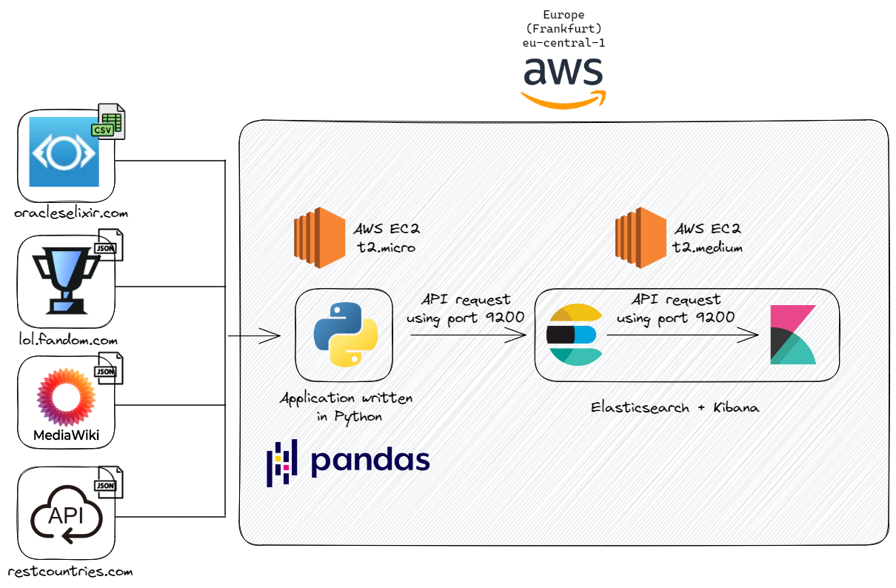
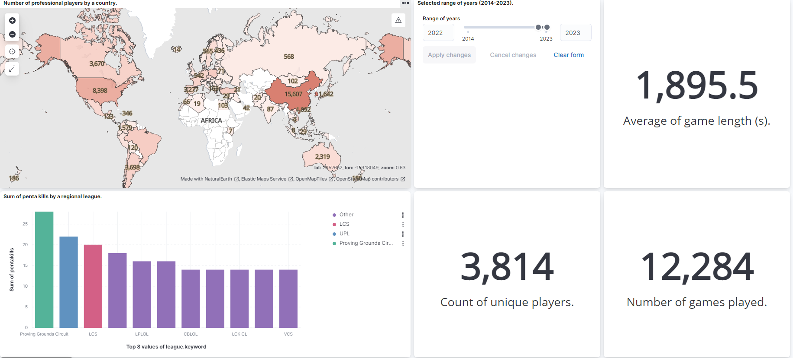

# Esports data pipeline

- This project aims to perform ETL on professional League of Legends e-sport match data and prepare it for further analysis. 


- The primary data source is [Oracle`s Elixir](https://oracleselixir.com/tools/downloads), which provides professional League of Legends e-sport match data from 2014 to nowadays. It's updated daily, and the matches from the corresponding calendar year have a separate .csv file. Definitions for the data in these files can be found or inferred from the information on the [Definitions page](https://oracleselixir.com/tools/downloads). To better understand the dataset, it's worth adding that each game consists of twelve rows (two teams and five players per team).


- Additional e-sport players' data is extracted from [Leaguepedia API](https://lol.fandom.com/wiki/Help:Leaguepedia_API). This step allows us to easily enrich the data by fetching other external resources. For example, geographic data enrichment involves adding country code or latitude and longitude to an existing dataset, enabling [Kibana's Maps](https://www.elastic.co/guide/en/kibana/current/maps.html) to visualize and explore the data.


- For the purpose of the project, it's important to mention that `game` and `match` have different meanings. A match comprises games, while a League of Legends game can be won by [destroying the enemy's Nexus](https://www.leagueoflegends.com/en-us/how-to-play/). It can take multiple games to win the entire match. Usually, LoL e-sport matches follow the `Best-of-N `format (where N is the maximum number of games), where you need to win more than half of them. For example, for Bo5 matches, the scores 3-0 or 2-3 are valid.
# Architecture diagram

 
_Diagram created using [Excalidraw](https://excalidraw.com/)._

1. Extract the match data from [Oracle's Elixir](https://oracleselixir.com/tools/downloads).
2. Enrich by extracting and transforming the data: 
- players' information using [Leaguepedia API](https://lol.fandom.com/wiki/Help:Leaguepedia_API),
- country geographic coordinates from [GeoData MediaWiki](https://www.mediawiki.org/wiki/Extension:GeoData),
- numeric country code [ISO 3166-1]((https://en.wikipedia.org/wiki/ISO_3166-1_numeric)) using [Rest Countries](https://gitlab.com/amatos/rest-countries).
3. Deploy the application and database on [AWS EC2](https://aws.amazon.com/ec2/) instances.
4. Load the data to [Elasticsearch](https://www.elastic.co/guide/en/elasticsearch/reference/current/index.html).
5. Explore the data and create a dashboard using [Kibana](https://www.elastic.co/guide/en/kibana/master/index.html).

# Dashboard
 

## Dashboard access
Please contact  me directly to gain access to the database and related dashboards (Viewer role).

# Project structure
```
📦Esports_data_pipeline
 ┣ 📂Elasticsearch
 ┃ ┣ 📜dashboards.txt # - Backup for dashboards created in Kibana.
 ┃ ┣ 📜index_template.txt # - Template settings and mappings for indices.
 ┃ ┣ 📜mapping.txt
 ┃ ┗ 📜visualizations.txt
 ┣ 📂images
 ┃ ┣ 📜architecture_diagram_v2.png
 ┃ ┣ 📜diagram_architecture.jpg
 ┃ ┗ 📜general_info_dashboard.png
 ┣ 📂src
 ┃ ┣ 📜data_enricher.py # - Data enrichment with additional extractions and data transformations.
 ┃ ┣ 📜data_extractor.py # - Extraction of main data.
 ┃ ┣ 📜elasticsearch_connector.py # - Connection between Python and Elasticsearch and data loading.
 ┃ ┗ 📜utils.py # - Utility functions related to the project.
 ┣ 📜.env
 ┣ 📜.gitignore 
 ┣ 📜READme.md
 ┣ 📜config.py # - Configuration file that contains constant variables.
 ┣ 📜main.py
 ┗ 📜requirements.txt
```

# Process
The focal part of the code is located in `main.py` file.
```
if __name__ == "__main__":
    elasticsearch_connector = ElasticsearchConnector(local=False)
    data = GetData(year=["2022"])
    data_enricher = DataEnricher(data)
    enriched_data = data_enricher.enrich_data(data.df_matches)
    elasticsearch_connector.send_data(message_list=enriched_data, batch_size=5000)
```
All relevant classes and function definitions designed for the project's purpose has been explicitly described below.
```
elasticsearch_connector = ElasticsearchConnector()
```
**ElasticsearchConnector** class - sets up and manages the connection between Python and Elasticsearch. Making the connection with a database more convenient by using [Python Elasticsearch Client](https://elasticsearch-py.readthedocs.io/en/v8.6.0/#python-elasticsearch-client) - a wrapper around Elasticsearch’s REST API. The client also contains a set of helpers for tasks like [bulk indexing](https://elasticsearch-py.readthedocs.io/en/v8.6.0/helpers.html#helpers), which increases the performance of loading the data to the database. Specify if the connection to Elasticsearch is made on localhost by setting the argument `local=True`. By default, the constructor method `__init__(self, local: bool = False):` connects to the `URL` provided inside `config.py`.
```
data = GetData(year=[2023], limits=None)
```
**GetData** class - downloads the .csv files with e-sport matches data:
- `year` to provide the list of years from 2014 to 2023 (included). Takes a current year as a default argument.
- `limits` narrows down the number of rows we want to extract from a data frame. By default, it takes `None`, so the entire data frame is processed instead.

The e-sport matches data is downloaded and stored as [pandas.DataFrame](https://pandas.pydata.org/docs/reference/api/pandas.DataFrame.html) object.
Next, it converts the provided list of years to find matching URL links stored inside `config.py`. Each csv file is stored on [Google Drive](https://drive.google.com/drive/u/1/folders/1gLSw0RLjBbtaNy0dgnGQDAZOHIgCe-HH), and it has a unique id.

Using helper function `convert_years_to_url(years: list, current_year: int) -> list:` which converts and then returns the unique list of URLs. If the provided year is not inside `CSV_FILES` dictionary. 

Afterwards auxiliary function `merge_csv_files` concatenates the files and stores them as a single data frame. Method `get_player_name(self) -> list:` returns, unique, non-empty lists of players from downloaded matches data.

```
data_enricher = DataEnricher(data)
enriched_data = data_enricher.enrich_data(data.df_matches)
```
**DataEnricher** class - enriches the data by handling additional extractions and data transformations. `enrich_data()` is a main method that transforms and prepares the data for being loaded into the database. Most of the data extractions are done in class constructor.

` extract_players(self) -> list:` - Extracts player data from [Leaguepedia API](https://lol.fandom.com/wiki/Help:Leaguepedia_API). 

`get_country_coordinates(self) -> dict`- Collects geographical coordinates as a GeoPoint(longitude, latitude) for unique list of countries using [MediaWiki API](https://www.mediawiki.org/wiki/Extension:GeoData). 

In case when the coordinates are not found for a specific country, the function `get_country_coordinates(self) -> dict` backfills the data by sending a GET request to [Rest Countries API](https://gitlab.com/amatos/rest-countries). Finally, appends to the main data frame in the function `append_coordinates_to_country()`.

`get_country_codes(self) -> dict:`- Fetches country codes in [ISO 3166-1 numeric encoding system](https://en.wikipedia.org/wiki/ISO_3166-1_numeric) from [Rest Countries API](https://gitlab.com/amatos/rest-countries). It allows to later visualize the geo-data in [Kibana](https://www.elastic.co/guide/en/kibana/master/index.html).

```
def enrich_data(self, main_df: pd.DataFrame) -> list:
   append_player_info(main_df, self.complementary_dict)
   append_country_to_player(main_df, self.complementary_dict)
   self.append_geo_coordinates(main_df)
   self.append_country_codes(main_df)
   append_id(main_df)
   return convert_to_json(main_df)
```
`append_player_info(df: pd.DataFrame, players_dict: dict):`- Adds the column with player info dictionary for each player occurrence in a 'playername' column.

`append_country_to_player(df: pd.DataFrame, player_dict: dict) -> pd.DataFrame:` - Adds a new column with a country name for a player.

`append_geo_coordinates(self, df_match: pd.DataFrame) -> pd.DataFrame:` - Adds a new column with geographic coordinates (longitude and latitude).

`append_country_codes(self, df_match: pd.DataFrame) -> pd.DataFrame:` - Adds a new column with country codes in ISO 3166-1 numeric encoding system.

`add_id_column()` - ensures a unique id for each row of the data by concatenating `gameid` and `participantid` for a given game.

`convert_to_json(df: pd.DataFrame) -> list:`- Converts a dataframe to json. It helps loading the data into Elasticsearch by using [pandas.DataFrame.to_json](https://pandas.pydata.org/docs/reference/api/pandas.DataFrame.to_json.html) with a`table` argument for`orient` to fit a dictionary like schema.

```
send_data(message_list=enriched_data, batch_size=5000, index: str = f"esports-data-{TODAY}")
``` 
Takes three keyword arguments: 
- `message_list` list of dictionaries containing the data.
- `batch_size` splits the list of items into batches of specified size. 

  Both of these arguments are passed to `create_msg_batches(messages: list, batch_size: int) -> list`, which utilizes the [bulk helper function](https://elasticsearch-py.readthedocs.io/en/7.x/helpers.html) to optimize the speed of loading the data into Elasticsearch.
- `index` specifies the name of an index where the data is loaded. It's recommended to provide the index name matching the pattern "`esports-data*`", which uses created template settings and mappings for indices. This step ensures the consistent data types for provided mappings when loading into Elasticsearch.

# Setup

## 1. AWS EC2
[AWS EC2](https://aws.amazon.com/ec2/) is the Amazon Web Service compute service that enables to create and run virtual machines in the cloud. You can follow the official [installation guide](https://docs.aws.amazon.com/AWSEC2/latest/UserGuide/EC2_GetStarted.html) to set up the EC2. For optimal performance of Elasticsearch and Kibana, it is recommended to use a machine with a minimum of 4GB of RAM and two virtual CPU cores. Choosing the `t2.medium` instance type during the installation process enables one to meet the requirements.

To connect to Linux EC2 instance, you can use SSH. For Unix-like
operating systems, you can use the terminal. For Windows,  follow one of these guides; [OpenSSH](https://docs.aws.amazon.com/AWSEC2/latest/UserGuide/openssh.html) or [PuTTY](https://docs.aws.amazon.com/AWSEC2/latest/UserGuide/putty.html).

To reduce the costs of a running instance, make sure to stop it after working with the application. Keeping `t2.medium` instance running for the entire month will exceed the [AWS free tier limits](https://aws.amazon.com/free/).

## 2. Elasticsearch and Kibana
Install Elasticsearch using a suitable [installation guide](https://www.elastic.co/guide/en/elasticsearch/reference/current/install-elasticsearch.html); if you follow this setup guide, you should
[install Elasticsearch with RPM](https://www.elastic.co/guide/en/elasticsearch/reference/current/rpm.html#rpm). The same goes for [Kibana installation](https://www.elastic.co/guide/en/kibana/current/rpm.html). Finally, create the enrollment token to configure Kibana instances to communicate with an existing Elasticsearch cluster using this [installation guide](https://www.elastic.co/guide/en/elasticsearch/reference/current/create-enrollment-token.html).

## 3. Environment variables 
In order to load the data inside Elasticsearch you need to create the `.env` file inside the main directory, like in the provided [project structure](#project-structure). Example `.env` file with Elasticsearch credentials  will look like this:
```
URL = "X.XX.XXX.XXX"
PORT = 9200
ELASTIC_USERNAME = "XXXXXXX"
ELASTIC_PASSWORD = "XXXXXXX"
```
To ensure a proper setup, you need to keep quotation marks `" "` for those values.

`URL = "X.XX.XXX.XXX" `- The IP address of your hostname, for example, the URL of AWS EC2 with Elasticsearch setup. It can be omitted if running the script on a local environment with Elasticsearch installed; in that case, you need to specify the argument for `ElasticsearchConnector(local=True)` inside `main.py`.


`PORT = 9200` - Default port 9200 to communicate with Elasticsearch, it is used for all API calls over HTTP. This includes search and aggregations, and anything else that uses the HTTP request.

`ELASTIC_USERNAME = "XXXXXXX"` - default username.

`ELASTIC_PASSWORD = "XXXXXXX"` - password provided during [Elasticsearch installation](https://www.elastic.co/guide/en/elasticsearch/reference/current/install-elasticsearch.html).


## 4. Running the project
In order to download and run the project on your local machine follow these steps:

```
git clone https://github.com/HerrKurz/Esports_Data_Pipeline.git
```
Creates a copy of the repository.
```
cd Esports_Data_Pipeline/
```
Moves inside directory. 

```
python3 -m venv venv
```
Creates a virtual environment, that allows you to manage separate package installations for this project.

```
source venv/bin/activate
```
Activate a virtual environment which puts the virtual environment-specific python and pip executables into your shell’s PATH.

```
pip install -r requirements.txt
```
Install the packages with for a specified version.

```
python3 main.py
```
Finally, run the script. 

Note that it might be necessary to execute `python` instead of `python3`, depending on unix-like distributions.

# Potential improvements and use cases
### Technologies
- Use a **data orchestration** tool to improve control over data flow [Apache Airflow
](https://airflow.apache.org/) or [Perfect](https://www.prefect.io/). Improve logging and automate the script to run the pipeline daily.
- Update the setup process using [Terraform](https://www.terraform.io/) to reuse and provision **infrastructure as a code**.


### Data enrichment:
- Add teams' data from [Leaguepedia API](https://lol.fandom.com/wiki/Help:Leaguepedia_API).
- Backfill missing players' data using [Liquipedia API](https://liquipedia.net/commons/Liquipedia:API_Usage_Guidelines).
- Use social media links associated with a player/team to gain insight into their social media reach, following etc. 

### Dataset could be used to:

- Calculate the relative skill levels of players using the [Elo rating system](https://en.wikipedia.org/wiki/Elo_rating_system).
- Create a classification model that determines whether given team will win the upcoming match.

