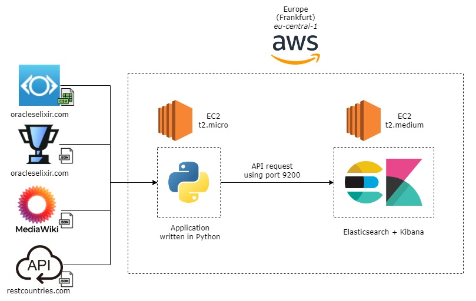

# Esports data pipeline

The purpose of this project is to build a data pipeline that extracts data from a professional League of Legends esports matches and provides a dashboard to display and analyze the data. It's an ETL (Extract, Transform, Load) process, where the data is primarily extracted from .

1. Extract the match data from [Oracle's Elixir](https://oracleselixir.com/tools/downloads).
2. Transform and enrich the data with player info [Leaguepedia API](https://lol.fandom.com/wiki/Help:Leaguepedia_API), country geographic coordinates [GeoData MediaWiki](https://www.mediawiki.org/wiki/Extension:GeoData), and ISO 3166-1 numeric country code [Rest Countries](https://gitlab.com/amatos/rest-countries).
3. Load the data to [Elasticsearch](https://www.elastic.co/guide/en/elasticsearch/reference/current/index.html).
4. Create a dashboard using [Kibana](https://www.elastic.co/guide/en/kibana/master/index.html). 
5. Deploy the app on [AWS EC2](https://aws.amazon.com/ec2/).

## Architecture diagram

## Dashboard

## 